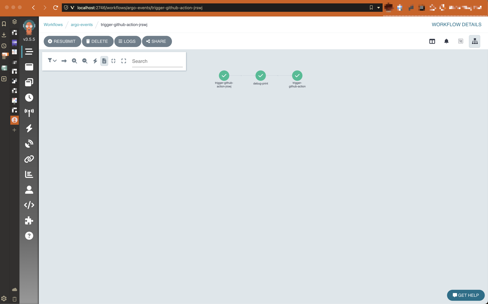

# Howdy 👋

A growing trend in the Kubernetes ecosystem is the repurposing of a Kubernetes cluster as a platform for building internal developer platforms. In this post we'll explore how we can glue together a few open source tools to do this.

Although the demo is simple, it should provide a conceptual starting point for more complex workflows.

If you want to follow along, you can find the code [here](https://github.com/markopolo123/crossplane-argo-demo).

## Overview

Here's what we are building:

> A way for users to create a github repo from a template, with some basic controls on that repository (naming convention and repo settings) and some automation around that to trigger a first run of a Github Action workflow.

Here's a diagram of the flow:



It looks complicated, but most of the components are hidden from the end users. The user only needs to submit a resource to the cluster, and the rest is automated. In a real world use case, the user would interact with a UI or CLI to submit the resource, rather than interacting with the cluster directly. Something like [backstage](https://backstage.io/docs/overview/what-is-backstage/), or a gitops pipeline.

## Demo Components

> The demo is entirely self-contained and runs on a local Kubernetes cluster.

The tooling we're going to use is:

* [Argo Events](https://argoproj.github.io/argo-events/) - to trigger workflows
* [Argo Workflows](https://argoproj.github.io/workflows/) - to run the workflows
* [Kyverno](https://kyverno.io) - to enforce policies
* [kubectl](https://kubernetes.io/docs/tasks/tools/) - to run a Kubernetes cluster locally
* [helm](https://helm.sh/docs/intro/install/) - to install the tools
* [Crossplane](https://docs.crossplane.io) - to provision cloud infrastructure
* [task](https://taskfile.dev/#/installation) - to run tasks (make alternative)
* [kind](https://kind.sigs.k8s.io/docs/user/quick-start/)
* [envsubst](https://www.gnu.org/software/gettext/manual/html_node/envsubst-Invocation.html) - to template the manifests

Additionally, the following tools were used to help build out the demo:

* [d2](https://d2lang.com) - to generate diagrams
* [k9s](https://k9scli.io) - to interact with the cluster
* [flox](https://flox.dev) - wrapper around `nix` for environment management

Before we have some fun let's quickly go through some of these choices.

[Crossplane](https://docs.crossplane.io) - it's a Kubernetes add-on that allows you to provision cloud resources using Kubernetes. In our case, we're going to use it to create a Github repository.

Next, we have [Kyverno](https://kyverno.io) - it's a policy engine for Kubernetes. We're going to use it to enforce a policy on the repository that gets created. We will use it to make sure the repository has a name that starts with `mark` and has visibility set to `private`

[Argo Events](https://argoproj.github.io/argo-events/) is a Kubernetes-native event-driven workflow automation framework. We're going to use it to "listen" for the creation of the repository and trigger an Argo Workflow.

[Argo Workflows](https://argoproj.github.io/workflows/) is a Kubernetes-native workflow engine. We're going to use it to run a Github Action workflow that will be triggered when the repository is created.

## Running the demo

> Note that this demo assumes some familiarity with Kubernetes and the tools mentioned above.

* Clone the repo
* Install the required tools
* Bootstrap the environment
* Run the demo

### Cloning the repo

```bash
git clone git@github.com:markopolo123/crossplane-argo-demo.git
cd crossplane-argo-demo
```

### Installing the required tools

If you are using [flox](https://flox.dev) you may simply do the following:

```bash
flox install && flox activate
```

If not, you will need to install tools from the list above manually.

### Get a GitHub PAT

You will need a GitHub Personal Access Token with permissions to create repositories and dispatch workflows. You can create one [here](https://docs.github.com/en/authentication/keeping-your-account-and-data-secure/managing-your-personal-access-tokens)

Once you have the token, you can add it to your environment:

```bash
export GITHUB_TOKEN="token-here"
export GITHUB_USERNAME=your-username-org-name
export ARGO_GITHUB_TOKEN=$(echo -n "Bearer $GITHUB_TOKEN" | base64)
```

the `BASE64_GITHUB_TOKEN` is used by Argo workflows.
I like to use `direnv` to manage my environment variables, but you can also add them to your shell profile.

### Bootstrapping the environment

```bash
task create <- creates a kind cluster
task bootstrap <- installs crossplane, argo-events, kyverno
task post-bootstrap <- configures argo-events, crossplane providers and kyverno
```

At this point you should have a kind cluster running with all the required tools installed.

### Running the demo

1. Create kyverno policies
2. Create crossplane resources
3. Check that the GitHub Action ran!

```bash
kubectl apply -f kyverno/repo-mutate-policy.yaml <- this will mutate the repository visibility to private
kubectl apply -f kyverno/repo-names-policy.yaml <- this will enforce a naming convention
kubectl apply -f crossplane/repo-no-validation.yaml
```

You may port forward the Argo Workflow UI to see the workflow in action:

> Note that auth is disabled in the UI in this demo

```bash
kubectl -n argo-events port-forward deployment/argo-server 2746:2746
```

Once forwarded, open http://localhost:2746 and you should see the workflow running.



Now you should see a new repository in your GitHub account, with the name `mark-repo` and visibility set to `private` . You should also see a new `successful` workflow run in the repository, which was triggered by the creation of the repository.

## Reflections

This demo is a simple example of how we can use Kubernetes and some open source tools to automate workflows. The tools we used are all CNCF projects and are widely used in the Kubernetes ecosystem.

### Why Not Terraform

Well, actually, you could use Terraform here. ControlPlane supports that via their Terraform provider, or you could replace that with [Flux's tofu Controller](https://github.com/flux-iac/tofu-controller). However, Terraform is not as "Kubernetes-native" as Crossplane is, we'd still need to handle state management and secrets.

### Why not just use GitHub Actions

Github Actions are great, but they are not as flexible as Argo Workflows and are tightly coupled to
Github and Github's events. Argo Workflows may be triggered by any event or tied into other business logic from your cluster. Additionally, Argo Workflows gives you a lot more control and flexibility.

While this is simple demo, it shows that we can use the the reconciliation loop and K8S API to build a powerful automation platform which *should* remove developer friction, make platform Engineers happy and keep security teams at ease.

## Next Steps

Developers having to use `kubectl` or follow a IAC GitOps pipeline is not ideal and adds cognitive overhead. Ideally they should not even know that Kubernetes is being used under the hood. In a real world scenario, we would build a UI or CLI that abstracts away complexity of the underlying tools.
