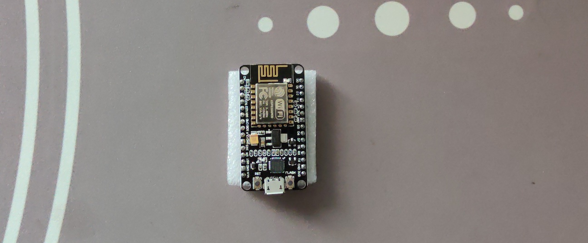
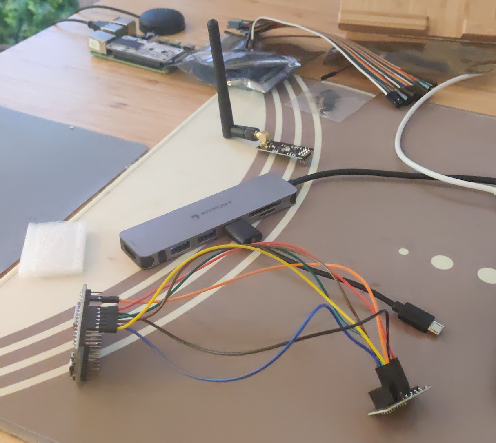
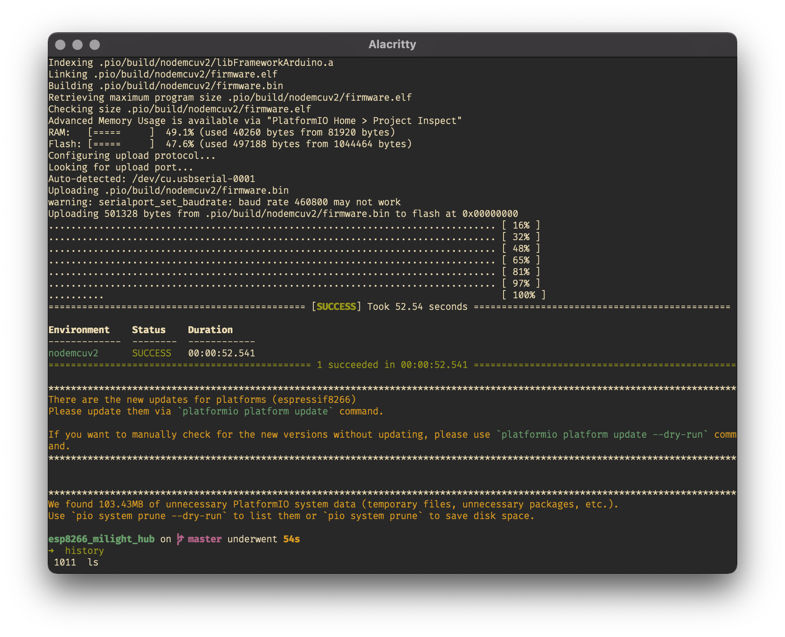

# Intro

Around five years ago I purchased some smart light bulbs. They are designed to
be used with a smart hub, [one of
these](https://www.amazon.co.uk/LIGHTEU®-Controller-Wireless-Downlight-Compatible/dp/B073WVLH3F/ref=asc_df_B073WVLH3F/?tag=googshopuk-21&linkCode=df0&hvadid=309968321179&hvpos=&hvnetw=g&hvrand=779779749495666085&hvpone=&hvptwo=&hvqmt=&hvdev=c&hvdvcmdl=&hvlocint=&hvlocphy=1006598&hvtargid=pla-467006343726&psc=1).
Turns out that the company behind this has made a new version of the hub, the
`miboxer` , which is not backwards compatible with the older bulbs. It also
requires an android app with a cloud account with rather dubious permission requirements to use.

I'm not a fan of this kind of behaviour from companies and would rather reuse
things where possible. With this in mind I set out to do some reverse
engineering. A few seconds later I discovered [this awesome
project](https://github.com/sidoh/esp8266_milight_hub) from [Christopher
Mullins](http://blog.christophermullins.com/2017/02/11/milight-wifi-gateway-emulator-on-an-esp8266/).
I love the Internet.

So, with lots of time saved, I set out to build a replacement hub for my smart
bulbs.

# The Shopping List

    | Item                         | Cost |
    | ---------------------------- | ---- |
    | ESP8266 NodeMCU CP2102       | £3   |
    | NRF24L01+PA+LNA RF           | £2   |
    | Dupont Female to Female Wire | £0   |

Ebay or Amazon have both the NodeMCUv2 and radio. I happened to have the dupont
wire already.



# Plugging it all in

[This guide](https://www.mysensors.org/build/connect_radio#nrf24l01+-&-esp8266)
details how to connect an NRF24 to an ESP8266

| NodeMCU     | Radio  | Color  |
| ----------- | ------ | ------ |
| GND         | GND    | Black  |
| 3V3         | VCC    | Red    |
| D2 (GPIO4)  | CE     | Orange |
| D8 (GPIO15) | CSN/CS | Yellow |
| D5 (GPIO14) | SCK    | Green  |
| D7 (GPIO13) | MOSI   | Blue   |
| D6 (GPIO12) | MISO   | Violet |



# Prepare for installation

I'm using a mac with homebrew, so the below steps assume familarity with the
terminal and homebrew

```
brew tap homebrew/cask-drivers
brew install --cask silicon-labs-vcp-driver
brew install gettext
brew link gettext --force
```

# Install the project

```
git clone https://github.com/sidoh/esp8266_milight_hub.git
cd esp8266_milight_hub
```

At this point I plugged the esp8266 into my laptop in preparation for
installation.

```
export ESP_BOARD=nodemcuv2
platformio run -e $ESP_BOARD --target upload
```

The output if successful looks like this:



# Adding to my WiFi network

This was pretty simple, just bare in mind that the NodeMCU only supports 2.4Ghz.
[The project readme ](https://github.com/sidoh/esp8266_milight_hub)has more
information on how to configure this.

# Pairing a light

This works the similarily to the official smarthub - hit the pair button in the
web UI within a few seconds of turning on the light and your done.

# Using the REST API

An example of using the rest API with curl to turn on a light:

```
 curl --request POST --header "Content-Type: application/json" --data '{
"state": "On"}' http://192.168.0.18/gateways/0x1/rgb_cct/0
```

# Next Steps
* Design and print a box
* Integrate with Home Assistant
* Make a nice friendly android app to control my lights
