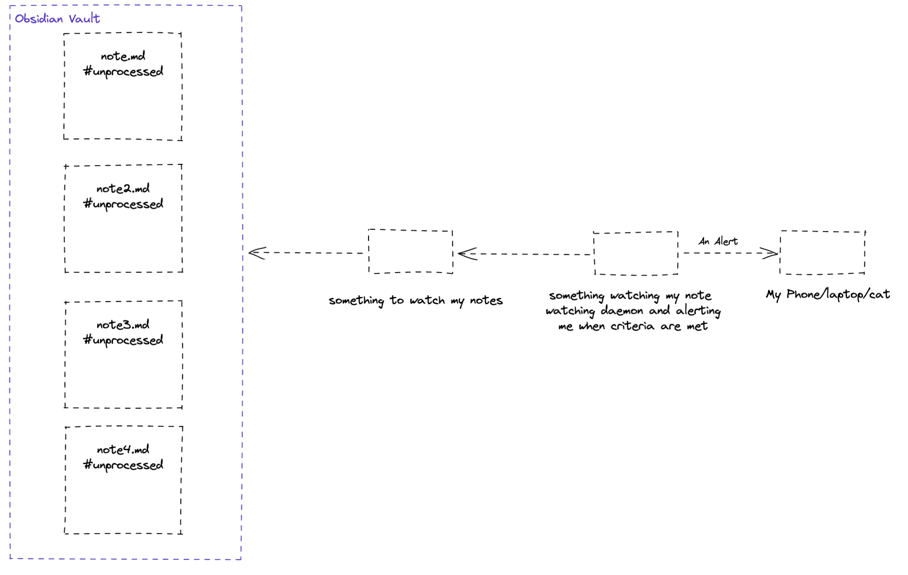
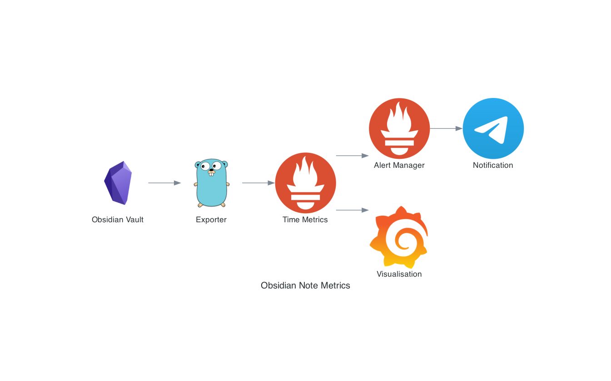

# Howdy! 👋

A fine thing happened recently: Obisidian v1.0.0 was released. Which I discovered
through this hacker news post. The comment section on Hacker News are usually 💰 
and this one was no exception, here is a quote from the top comment:

    Finally, a note taking application with a decent API that's allowed me to extract metadata and publish metrics into CloudWatch, allowing me to track key metrics and graphically[0] review historical trends of my "second brain." Previous note taking applications I've tried in the past (e.g. Zettlr, Bear) lacked the vibrant developer community that Obsidian has cultivated.

👆 Posts like this keep me coming back to Hacker News. Also, game recognises game. Here's
a link their [blog post](https://digitalorganizationdad.substack.com/p/stop-zettelkasten-literature-notes) explaining the full stack and pipeline.

I bet you are sat there saying what if we could do something similar, but using 
only self hosted tools?

Well you, friend, are in luck.

## Beginning the yak shaving

Here is the flow I came up with for this experiment.

My daily template in Obsidian autopopulates the `#unprocessed` tag. In theory these are
processed daily, however, in practise that frequently doesn't happen.

This is the stack:

Tech|Use|
-----|-----|
Golang|Used to create the prometheus exporter|
Prometheus|Used to track note metrics|
Alert Manager|For handling alerts|
Telegram|To receive notifications|
Grafana|For visualising note metrics|

First things first, [we need a program](https://github.com/markopolo123/obsidian-metrics) which can expose the unprocessed notes as a prometheus compatible metric. Follow the link to get instructions on
how to set that up.

## Consuming the data

I already have Prometheus, Alert Manager and Grafana running in my network, however, 
the [example directory](https://github.com/markopolo123/obsidian-metrics/tree/main/example) contains a docker-compose example in case you want to get up and
running quickly.

You'll need to make a few changes to the [alertmanager config](https://github.com/markopolo123/obsidian-metrics/blob/main/example/alertmanager/alertmanager.yml.tpl) and possibly check the [prometheus scrape config](https://github.com/markopolo123/obsidian-metrics/blob/f829e7db870602153bf0ff05d1aac531d3ab9ec2/example/prometheus/prometheus.yml#L24) too.

## Next Steps

* The exporter could be extended to show more metrics from your vault.
* I'd also consider removoing the additional prom stack and use something like this [library](https://github.com/nikoksr/notify) instead.
* Grafana Dashboard for the truly insane who wish to graph their note history.
