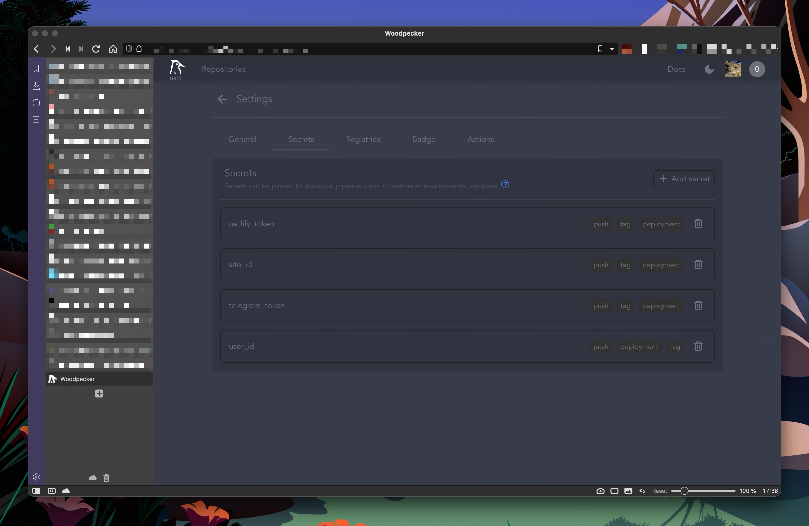

# Howdy! 👋

I've been using [woodpecker](https://woodpecker-ci.org) instead of [drone](https://www.drone.io) for my self hosted CI/CD needs.
At some point I'll do a full write up on my deployment, for now here's a quick post on how I configured a pipeline for deploying my personal [hugo](https://gohugo.io) based website to [Netlify](https://www.netlify.com).

# Preparation

I already have a self hosted gitea and woodpecker with a runner configured.

## The pipeline

Woodpecker jobs are defined in `yaml` format, Woodpecker allows for jobs be declared in
a single file ( `.woodpecker.yml` ) or split out into multiple files inside a directory
called `.woodpecker/` . This directory can also be [overriden](https://woodpecker-ci.org/docs/usage/project-settings).

What follows is an example for the following git work flow:

What the pipeline needs to do:
* Create a staging site for the dev branch, which gets recreated everytime a commit is pushed to the feature branch.
* Each push to the `master branch` should build and publish the production site.
* The pipeline should fail if the build does not complete successfully
* I should be notified via Telegram if the build succeeds or fails.

```yaml
pipeline:
  get-theme:
    image: alpine/git
    commands:
      - git clone https://github.com/rhazdon/hugo-theme-hello-friend-ng.git themes/hello-friend-ng
      - cp index.html themes/hello-friend-ng/layouts/
      - mkdir -p themes/hello-friend-ng/layouts/_default/_markup/
      - cp render-codeblock-mermaid.html themes/hello-friend-ng/layouts/_default/_markup/render-codeblock-mermaid.html
      - cat mermaid >> themes/hello-friend-ng/layouts/partials/javascript.html
  hugo-build:
    image: klakegg/hugo:0.93.2-alpine-ci
    commands:
      - "hugo -t hello-friend-ng"
  staging-deploy:
    image: lucap/drone-netlify
    site_id: your-site-id-goes-here
    secrets: [netlify_token]
    path: ./public/
    when:
      branch:
        exclude: [master]
  notify-staging:
    image: appleboy/drone-telegram
    settings:
      token:
        from_secret: telegram_token
      to:
        from_secret: user_id
      format: markdown
      message: >
        ✅ Build ${CI_BUILD_EVENT} of `${CI_REPO_NAME}` has status ${CI_BUILD_STATUS}.
        📝 Commit by ${CI_COMMIT_AUTHOR} on `${CI_COMMIT_BRANCH}`:
        `${CI_COMMIT_MESSAGE}`
        🌐 ${CI_BUILD_LINK}
    when:
      branch:
        exclude: [master]
  deploy-production:
    image: lucap/drone-netlify
    site_id: 123qwerty
    secrets: [netlify_token]
    path: ./public/
    when:
      branch: [master]
  notify-prod:
    image: appleboy/drone-telegram
    settings:
      token:
        from_secret: telegram_token
      to:
        from_secret: user_id
      format: markdown
      message: >
        ✅ Build ${CI_BUILD_EVENT} of `${CI_REPO_NAME}` has status ${CI_BUILD_STATUS}.
        📝 Commit by ${CI_COMMIT_AUTHOR} on `${CI_COMMIT_BRANCH}`:
        `${CI_COMMIT_MESSAGE}`
        🌐 ${CI_BUILD_LINK}
    when:
      branch: [master]
```

While you can use plugins built for drone, figuring out the syntax for
use with Woodpecker can take a little bit of effort.

### Secrets

The pipeline has a few secrets, these were added through the web UI or via the CLI.



### Limitations

As of 20221008 Woodpecker currently does not have a way to pass the output of a job to another unless
you write data to a file and have another task read it. It would be great to not have
to do that!
